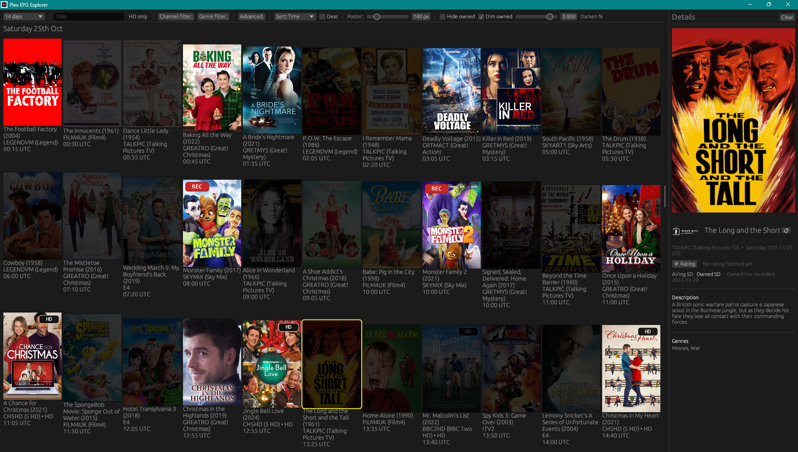

# Pex (Plex EPG Explorer)

If you're old-fashioned like me and still enjoy flicking through the next week of TV films, this app is for you. Pex is my personal way to dig through two weeks of Plex DVR listings and decide what to record, and—most importantly—see which airings I already own in Plex, all in a super-visual grid.

Pex helps you browse upcoming film broacasts in a more advanced way:
- Browse up to 14 days of film listings in the Plex EPG with a poster-forward layout.
- Choose to visually dim movies you already own or hide them from the grid entirely.
- Spot HD airings, including HD upgrades for titles you currently only have in SD.
- See at a glance which films are already scheduled to record in Plex (does not support schedualling, i want to keep the app focused on browsing)
- Bring channel art, genre groupings, and on-demand IMDb ratings (click the ⭐ button in the detail pane) into the experience while keeping everything cached locally for speedy, offline-friendly launches.

If you downloaded this release bundle from the main repo, all you need to do is fill in `config.json`. The only real prerequisite is that you’re a Plex TV user relying on the standard EPG. When you use `owned_source = "plex_library"`, the mirrored Plex database brings back everything you own, so the `library_roots` array is optional—only add folders if you want to narrow things down or document where your media lives.

There’s still a filesystem scan mode you can enable in the config, but it’s strictly optional now. It’s handy if you can’t copy Plex’s library database, yet it’s slower on big collections, which is why I default to the Plex DB mirror.

Because the app is written in Rust, the portable build runs on Windows, Linux, and macOS. It’s easy to tweak too—grab the source, point your favourite AI at the primer file I included, and you’ll have a head start on customising the code for your setup. The most likley change people will make is adapting the title parsing if their files don’t follow the `Title (Year)` pattern the app expects today.

Need a head start on the paths? See `config_example.windows` and `config_example.linux` in this folder for realistic sample values covering common Plex installations and multi-library layouts.

---

## What’s inside?

- `pex.exe` (Windows) or `pex` (Linux/macOS) – the application binary.
- `config.json` – edit this to match your Plex setup and movie library.
- `README.md` – this guide.
- `db/` (created on first run) – Pex will copy your Plex EPG database here.
- `.pex_cache/` (created on first run) – stores posters, owned manifest, and ffprobe cache.

---

## Quick start

1. **Unzip / extract the bundle** to a folder where you have write access. Pex
   stores cache files alongside the executable.

2. **Install prerequisites**
   - Ensure Plex DVR/EPG is enabled so its SQLite database exists.
   - Install FFmpeg (or just `ffprobe`) **only if** you plan to use the
     filesystem-owned scan (`"owned_source": "filesystem"`). Plex-library mode
     does not require FFmpeg; when needed you can point `ffprobe_cmd` at the
     executable.
   - No extra SQLite packages are required on Windows: the portable binary ships
     with SQLite via `rusqlite`'s bundled driver. On Linux the portable build
     also links SQLite statically; just make sure you're on a glibc-based
     distro.

3. **Edit `config.json`** – update the paths and options so they match the
   machine you will run Pex on. Each key is described in detail in
   [Configuration keys](#configuration-keys) below.

4. **Launch the app**
   - Windows: double-click `pex.exe` or run it from PowerShell.
   - Linux/macOS: `chmod +x ./pex` (if needed) then run `./pex`.

Pex will make local copies of your plex DB's just to avoid any chance of disruption. it will make new copies each time it is opened. The first start can take a few mins to download the movie posters, but once initial data is cached it is quick to start, it will also remember your preferences when set.
General workflow:
- Pex copies the Plex database from `plex_epg_db_source`.
- It copies Plex’s library database if `plex_library_db_source` is set.
- If you're using the Plex library-owned mode, it tags owned titles straight from that mirrored DB; only when you enable filesystem mode does it walk through `library_roots`.
- It warms up posters into the grid.

Subsequent launches load almost immediately.

---

## Configuration keys

| Key | Required? | Description | Where to find the value |
| --- | --- | --- | --- |
| `plex_epg_db_source` | ✅ | Absolute path to Plex's EPG database (`tv.plex.providers.epg.cloud*.db`). Pex copies it into `db/plex_epg.db` the first time you launch and refreshes the copy roughly once per day. | See [Collecting Plex paths](#collecting-plex-paths) for examples. |
| `plex_library_db_source` | Recommended | Path to `com.plexapp.plugins.library.db`. Enables fast owned detection and the DVR *REC* badge by mirroring Plex's library database into `db/plex_library.db`. | See [Collecting Plex paths](#collecting-plex-paths) for examples. |
| `library_roots` | ✅ | Array of folders containing your movie files. Use forward slashes on every OS (`"D:/Media/Movies"` or `"/mnt/media/movies"`). Files should follow the Plex naming pattern `Title (Year).ext` so scans match the guide. | Use platform file explorer or the NAS share path mounted on this machine. |
| `owned_source` | ✅ | `"plex_library"` (recommended) reads owned titles from the copied Plex library DB; `"filesystem"` crawls `library_roots`. Filesystem mode can take a long time on large libraries but works without the library DB. | Choose based on whether you can copy `com.plexapp.plugins.library.db`. |
| `ffprobe_cmd` | Optional | Override path to `ffprobe` if it isn’t on `PATH`. | `where ffprobe` (Windows) or `which ffprobe` (Linux/macOS). Leave `null` to use the system default. |
| `omdb_api_key` | Optional | API key for IMDb ratings. The demo key `thewdb` (the official OMDb sample) is included but heavily rate limited. | Sign up at <https://www.omdbapi.com/apikey.aspx>. |
| `cache_dir` | Optional | Relocates `.pex_cache/` (posters, manifests, ffprobe cache, UI prefs). Relative paths are resolved next to the executable. | Pick a writable folder with enough free space. |
| `log_level` | Optional | Adjusts runtime logging (`trace`, `debug`, `info`, `warn`, `error`). | Set only if you need more verbose console output. |

### Collecting Plex paths

Plex stores its SQLite databases under “Plug-in Support/Databases”. Common locations:

| Platform | Default path |
| --- | --- |
| **Windows (desktop)** | `%LOCALAPPDATA%\Plex Media Server\Plug-in Support\Databases\` |
| **Windows (service install)** | `%PROGRAMDATA%\Plex Media Server\Plug-in Support\Databases\` |
| **Linux packages** | `/var/lib/plexmediaserver/Library/Application Support/Plex Media Server/Plug-in Support/Databases/` |
| **Synology package** | `/var/packages/Plex Media Server/target/Plex Media Server/Plug-in Support/Databases/` |
| **Docker** | Host folder bound to `/config/Library/Application Support/Plex Media Server/Plug-in Support/Databases/` |

Look in that directory for:

- `tv.plex.providers.epg.cloud.db`
- `com.plexapp.plugins.library.db`

Copy the full paths into `config.json`. Pex pulls in any companion journal data
for you, so you only need the main `.db` path. If you cannot copy
the library DB, leave `plex_library_db_source` unset and use
`owned_source = "filesystem"` instead.

---

## Where files are stored

| Location | Purpose |
| --- | --- |
| `db/plex_epg.db` | Working copy of Plex's EPG database. |
| `db/plex_library.db` | Optional working copy of Plex's library database (if configured). |
| `.pex_cache/` | Posters, owned-manifest, ffprobe cache, and UI preferences. Poster images older than 14 days are removed automatically. |
| `config.json` | Runtime configuration – edit before launching. |

You can delete `.pex_cache/` if you want to reclaim space; Pex rebuilds it on
the next run (expect another long initial scan while it repopulates).

---

## Windows vs. Linux/macOS differences

- **Paths** – stick to forward slashes in `config.json`. Windows backslashes
  must be escaped (`"D:\\\\Media"`), so forward slashes are easier.
- **ffprobe location** – on Windows, FFmpeg installers typically place
  `ffprobe.exe` under `C:/Program Files/FFmpeg/bin`. On Linux it’s usually in
  `/usr/bin/ffprobe`.
- **Executable name** – Windows builds end with `.exe`; Linux/macOS builds are
  just `pex`. The rest of the bundle layout is identical.

---

## Troubleshooting

- **“Could not open Plex DB”** – check `plex_epg_db_source` or ensure
  `db/plex_epg.db` exists and is readable.
- **Owned scan never finishes** – confirm each `library_root` path exists and
  that the drive/share is mounted.
- **No posters or very slow start** – verify the machine has internet access and
  that `.pex_cache/` is writable.
- **HD badge seems wrong** – run the app, open **Advanced** ▸ **Refresh ffprobe
  cache**, and make sure `ffprobe_cmd` points to a modern FFmpeg build.

If you need a deeper reference, open the repository’s main guide:
<https://github.com/AnicetusCer/pex#readme>.

Enjoy Pex!
